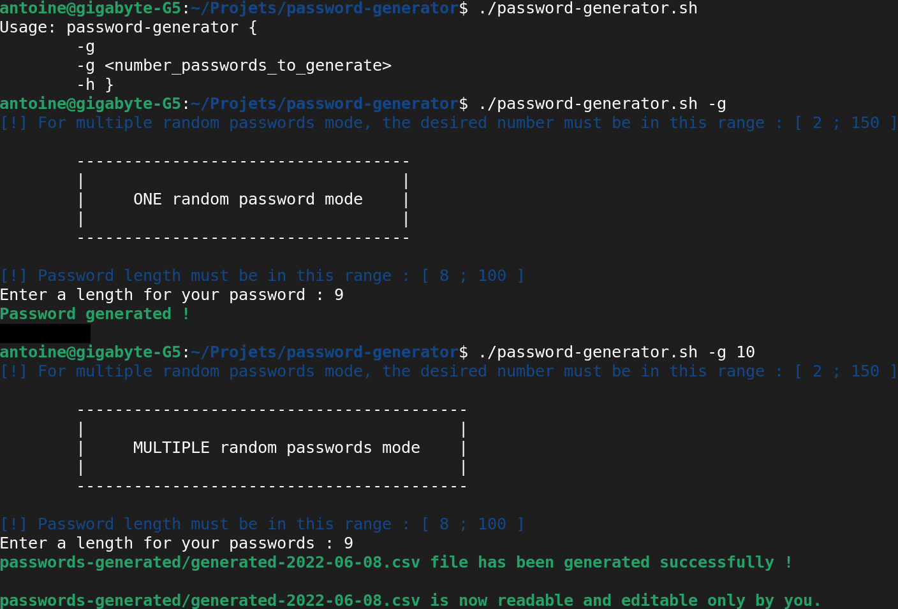

# password-generator

The password-generator.sh script generates __one or multiple random passwords__.

In the multiple random passwords mode, passwords generated are stored in a protected __.csv__ file readable and writable only by you.

The password must contain, __at least__, one uppercase letter, one lowercase letter, one number and one special character.

- If you don't know a specific length for your future password, __15__ is __recommended__ to have a strong and complex password.
______________________________________

# Need some help ?

```
- -g : generate a random password with the length ∈ [ 8 ; 100 ] chose by the user
- -g <number_passwords_to_generate> : generate multiple random passwords with the desired number ∈ [ 2 ; 150 ] 
    and the length ∈ [ 8 ; 100 ] chose by the user
- -h : help
```

# Example of use



______________________________________

__Some references about the passwords :__  
- https://owasp.org/www-community/password-special-characters  
- https://en.wikipedia.org/wiki/Password_strength  
- https://www.quora.com/What-is-the-best-password-length 